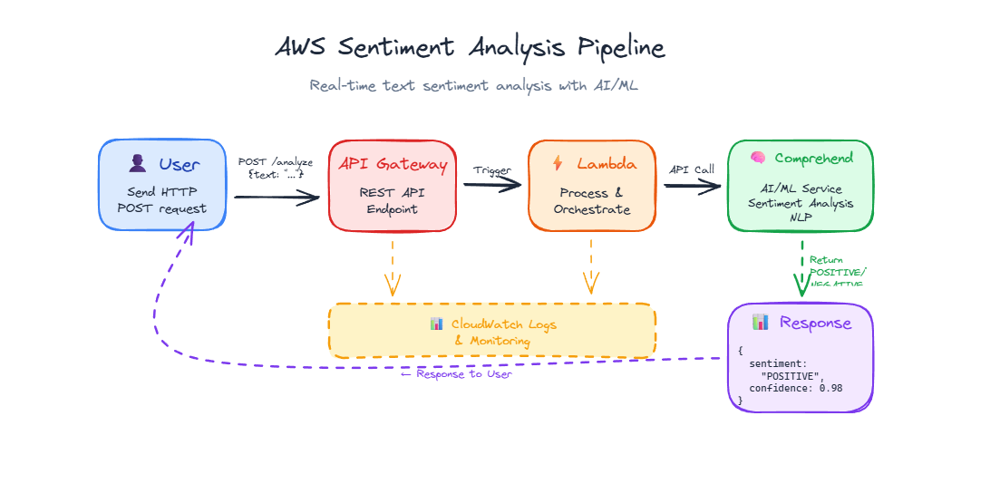

# AWS Sentiment Analysis Pipeline - Complete Setup Guide

## 🎯 Project Overview

Build a serverless AI-powered sentiment analysis API using AWS services in under 1 hour. This pipeline analyzes text and returns sentiment classification (POSITIVE, NEGATIVE, NEUTRAL, or MIXED) with confidence scores.

### Architecture



### AWS Services Used

- **API Gateway**: REST API endpoint to receive HTTP requests
- **Lambda**: Serverless compute to process requests
- **Amazon Comprehend**: AI/ML service for sentiment analysis
- **DynamoDB**: NoSQL database to store sentiment analysis history
- **IAM**: Permissions management
- **CloudWatch**: Logging and monitoring

---

## 📋 Prerequisites

- AWS account with sandbox/lab access
- Basic familiarity with AWS Console
- Text editor (for testing HTML page)
- Postman or curl (for API testing)

---

## 🚀 Step-by-Step Instructions

### Step 1: Create DynamoDB Table (5 minutes)

1. **Navigate to DynamoDB Console**
   - Search for "DynamoDB" in AWS Console
   - Click **Create table**

2. **Configure Table**
   - Table name: `SentimentAnalysisHistory`
   - Partition key: `id` (String)
   - Sort key: `timestamp` (Number)
   
3. **Table Settings**
   - Table class: **DynamoDB Standard**
   - Capacity mode: **On-demand** (pay per request)
   
4. **Create Table**
   - Leave all other settings as default
   - Click **Create table**
   - Wait ~30 seconds for table to become Active

---

### Step 2: Create Lambda Function (10 minutes)

1. **Navigate to Lambda Console**
   - Search for "Lambda" in AWS Console
   - Click **Create function**

2. **Configure Function**
   - Choose: **Author from scratch**
   - Function name: `SentimentAnalyzer`
   - Runtime: **Python 3.11** (or latest Python 3.x)
   - Architecture: **x86_64** (default)
   - Click **Create function**

3. **Configure Permissions**
   - Click **Configuration** tab
   - Click **Permissions** in left sidebar
   - Click on the **Role name** (opens IAM in new tab)
   - In IAM, click **Add permissions** → **Attach policies**
   - Search and attach these policies:
     - `AWSLambdaBasicExecutionRole` (should already be attached)
     - `ComprehendFullAccess`
     - `AmazonDynamoDBFullAccess`
   - Click **Add permissions**

4. **Add Lambda Code**
   
   Refer to `lambda_function.py` file for the complete code.

5. **Deploy the Function**
   - Click **Deploy** button (orange button at top)

6. **Test Lambda Directly**
   - Click **Test** tab
   - Click **Create new event**
   - Event name: `TestSentiment`
   - Event JSON:
   ```json
   {
     "body": "{\"text\": \"I love this product! It's amazing!\"}"
   }
   ```
   - Click **Save**
   - Click **Test**
   - Expected result: `"sentiment": "POSITIVE"` with high confidence

---

### Step 3: Create API Gateway (15 minutes)

#### 3.1 Create New API

1. **Navigate to API Gateway Console**
   - Search for "API Gateway"
   - Click **Create API**

2. **Choose API Type**
   - Select **REST API** (not Private)
   - Click **Build**

3. **Configure API**
   - Protocol: **REST**
   - Create new API: **New API**
   - API name: `SentimentAPI`
   - Description: (optional) "AI Sentiment Analysis API"
   - Endpoint Type: **Regional**
   - Click **Create API**

4. **Choose Security Policy**
   - When prompted for security policy, select:
   - ✅ **SecurityPolicy_TLS13_1_3_2025_09 (recommended)**
   
   > 💡 This is the latest TLS 1.3 policy and is recommended by AWS. It's secure and compatible with all modern clients (curl, browsers, Postman).

#### 3.2 Create Resource

1. **Create Resource**
   - Click **Actions** → **Create Resource**
   - Or click **Create resource** button

2. **Resource Configuration**
   - Resource path: `/` (root)
   - Resource name: `analyze`
   - ✅ **Enable CORS** (Check this box!)
   
   > ⚠️ **Important**: Enable CORS to allow web browsers to call your API. This is required for the HTML test page and any web applications.
   
   - Click **Create resource**

#### 3.3 Create POST Method

1. **Add Method to Resource**
   - Select the `/analyze` resource (click on it)
   - Click **Actions** → **Create Method**
   - Select **POST** from dropdown
   - Click the checkmark ✓

2. **Configure Method Integration**
   - Integration type: **Lambda Function**
   - ✅ **Use Lambda Proxy integration** (CHECK THIS BOX!)
   
   > ⚠️ **Critical**: Lambda Proxy integration must be enabled! Without it, API Gateway sends a different event format that our Lambda code doesn't expect, causing "Internal server error".
   
   - Lambda Region: Select your region (e.g., us-east-1)
   - Lambda Function: Start typing `SentimentAnalyzer` and select it
   - Click **Save**

3. **Grant Permission**
   - A popup will appear: "Add Permission to Lambda Function"
   - Click **OK**
   
   > 💡 This automatically grants API Gateway permission to invoke your Lambda function. AWS updates the Lambda function's resource-based policy for you.

#### 3.4 Deploy API

1. **Deploy the API**
   - Wait for any "API is updating" messages to clear (30-60 seconds)
   - Click **Actions** → **Deploy API**

2. **Deployment Configuration**
   - Deployment stage: **[New Stage]**
   - Stage name: `prod` (or `testing`, `dev` - your choice)
   - Stage description: (optional)
   - Click **Deploy**

3. **Get Your API URL**
   - After deployment, you'll see **Invoke URL** at the top
   - Example: `https://abc123xyz.execute-api.us-east-1.amazonaws.com/prod`
   - **Copy this URL!** You'll need it for testing

---

## 🧪 Testing Your API

### Test 1: Using curl (Command Line)

Replace `YOUR-API-URL` with your actual Invoke URL:

```bash
curl -X POST https://YOUR-API-URL/prod/analyze \
  -H "Content-Type: application/json" \
  -d '{"text": "I love this product! It is amazing!"}'
```

**Expected Response:**
```json
{
  "sentiment": "POSITIVE",
  "confidence": 0.9876,
  "scores": {
    "Positive": 0.9876,
    "Negative": 0.0012,
    "Neutral": 0.0098,
    "Mixed": 0.0014
  }
}
```

> 💡 **Note**: This request also saves the analysis to DynamoDB for future reference!

### Test 2: Using Postman

1. **Create New Request**
   - Method: **POST**
   - URL: `https://YOUR-API-URL/prod/analyze`
   
2. **Set Headers**
   - Key: `Content-Type`
   - Value: `application/json`

3. **Set Body**
   - Select **raw** and **JSON**
   - Enter:
   ```json
   {
     "text": "I love this product!"
   }
   ```

4. **Send Request**
   - Click **Send**
   - Check response at bottom

---

## 📊 Viewing Stored Data in DynamoDB

### View Your Analysis History

1. **Navigate to DynamoDB Console**
   - Search for "DynamoDB" in AWS Console
   - Click **Tables** in left sidebar

2. **Select Your Table**
   - Click on `SentimentAnalysisHistory`

3. **View Items**
   - Click **"Explore table items"** button (top right)
   - You'll see all sentiment analyses in a table view
   - Each row shows: `id`, `timestamp`, `request_text`, `sentiment`, `confidence`, `scores`

4. **View Individual Records**
   - Click on any item to see full JSON details

### Query Your Data

You can filter and query your stored data:

1. In **"Explore table items"** view
2. Click **"Scan or query items"**
3. Add filters:
   - Filter by sentiment: `sentiment = POSITIVE`
   - Filter by confidence: `confidence > 0.9`
   - Filter by text: `request_text contains love`

---

## 📊 Understanding the Response

### Response Structure

```json
{
  "sentiment": "POSITIVE",
  "confidence": 0.9876,
  "scores": {
    "Positive": 0.9876,
    "Negative": 0.0012,
    "Neutral": 0.0098,
    "Mixed": 0.0014
  }
}
```

## 🎓 What You Built

### Architecture Components

✅ **Serverless REST API** - No servers to manage, auto-scales  
✅ **AI-Powered Analysis** - Using AWS managed AI service  
✅ **Data Persistence** - All analyses stored in DynamoDB  
✅ **Production-Ready** - Proper error handling and CORS support  
✅ **Cost-Effective** - Pay only for what you use  
✅ **Secure** - TLS 1.3 encryption, IAM permissions  

### Real-World Use Cases

- 📝 Customer review analysis
- 💬 Social media monitoring
- 🎫 Support ticket classification
- 📧 Email sentiment tracking
- 💬 Chat message analysis
- 📊 Product feedback analysis

---

## 📚 Additional Resources

- [AWS Lambda Documentation](https://docs.aws.amazon.com/lambda/)
- [Amazon Comprehend Documentation](https://docs.aws.amazon.com/comprehend/)
- [API Gateway Documentation](https://docs.aws.amazon.com/apigateway/)
- [AWS Free Tier Details](https://aws.amazon.com/free/)

---

## ✅ Summary

You successfully built a complete serverless AI sentiment analysis pipeline using:
- **API Gateway** for REST endpoint
- **Lambda** for serverless compute
- **Comprehend** for AI-powered sentiment analysis
- **DynamoDB** for storing analysis history
- **IAM** for security and permissions

**Total setup time**: Under 1 hour  
**Total cost**: Free tier or ~$1-2/month  
**Scalability**: 1 to 1 million requests automatically  

**Congratulations! 🎉** You now have a production-ready AI API!