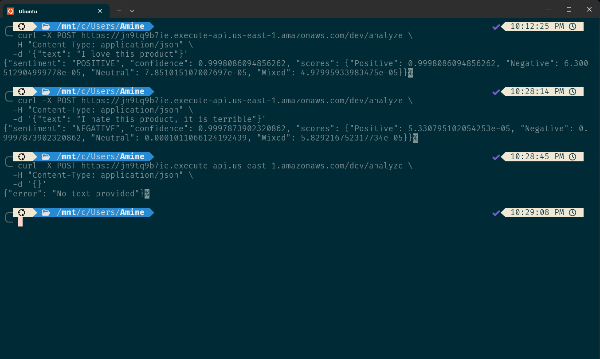
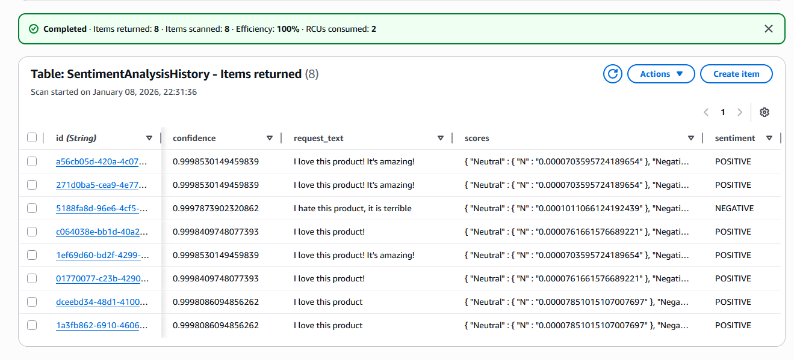
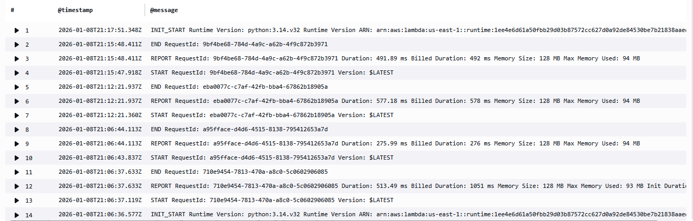

# 📊 Results & Verification

This section shows how the Sentiment Analysis API behaves in real usage, including successful requests, failure handling, data persistence, and observability.

## 🔁 API Testing

### Curl Request




---

### Postman Request 

The API can also be tested using Postman with:

- **Method:** POST
- **Header:** `Content-Type: application/json`
- **Body:**

```json
{
  "text": "I love this product!"
}
```

📸 **Screenshot:** Postman successful request


---

## 🗄 DynamoDB – Stored Results

Each API request is stored in DynamoDB for traceability and analytics.

**Stored attributes include:**

- `id` (UUID)
- `timestamp`
- `request_text`
- `sentiment`
- `confidence`
- `scores`

📸 **Screenshot:** DynamoDB table items view



---

## 📈 CloudWatch Logs

Lambda executions are logged automatically in CloudWatch.

**Log group:**

```
/aws/lambda/SentimentAnalyzer
```

**Logs include:**

- Request lifecycle (`START`, `END`, `REPORT`)
- Execution duration
- Error details (if any)

These logs enable monitoring, debugging, and performance analysis.

📸 **Screenshot:** CloudWatch Lambda logs



---

## ✅ Summary

- The API correctly processes sentiment analysis requests
- Invalid inputs are safely handled with clear error messages
- All results are persisted in DynamoDB
- Full observability is provided via CloudWatch logs

This confirms the solution is functional and reliable.